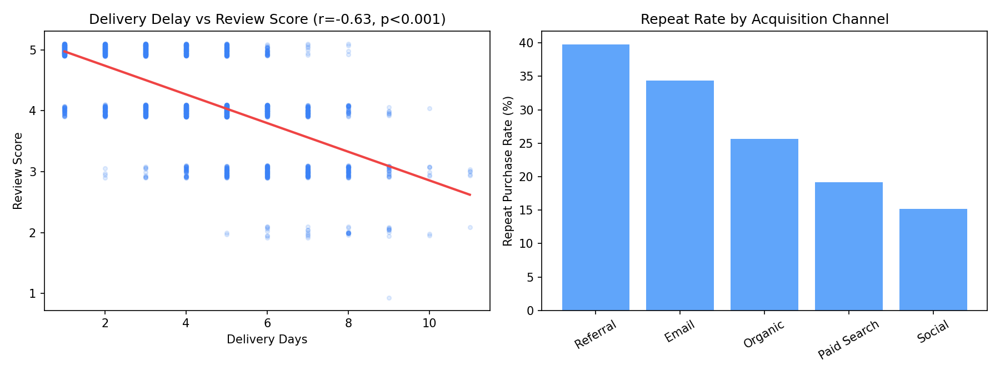

# 🛍️ E-commerce Marketing & Customer Analytics

<div align="center">

### From "which channel spends the least" to "which channel actually earns its keep"

[](https://www.python.org/)
[](https://www.sqlite.org/)
[](https://pandas.pydata.org/)
[](https://scikit-learn.org/)
[](https://scipy.org/)

</div>

<br>

## 📖 Overview

Most marketing dashboards stop at "Channel X brought 500 customers." They rarely answer the harder question underneath: **is that actually good, and can we trust the pattern, or is it noise?**

This project analyzes a simulated e-commerce business — 3,000 customers, 4,300+ orders, 5 marketing channels — using two layers most BI-only projects skip:

1. **Advanced SQL** (CTEs, window functions, self-joins) to build RFM segments, cohort retention, and channel ROI directly in the database
2. **Statistical hypothesis testing & modeling** in Python (correlation, t-tests, chi-square, logistic regression) to check whether the patterns are statistically real before acting on them

> **"Which acquisition channel should we actually invest in — not by spend, but by proof?"**

<br>

## ⚠️ Data Note

The dataset is **simulated** (Python/NumPy) for portfolio purposes, with realistic, intentional relationships built in (e.g. delivery delay affecting review scores, channel affecting retention) so the statistics have genuine signal to detect — not real company data.

<br>

## 🎯 Business Questions Answered

| # | Question | Method |
|---|---|---|
| 1 | Which customers are most valuable, and who's about to churn? | SQL RFM segmentation (window functions) |
| 2 | Which channel actually delivers the best ROI, not just the most signups? | SQL join across orders + marketing spend, `RANK()` |
| 3 | Does delivery delay *really* hurt satisfaction, or is it a coincidence? | Pearson correlation + significance test |
| 4 | Do high-retention channels really have a higher order value, or does it just look that way? | Independent t-test |
| 5 | Is acquisition channel actually linked to repeat-purchase behavior? | Chi-square test of independence |
| 6 | Can we predict, from a customer's *first* order, whether they'll come back? | Logistic regression |

<br>

## 🏗️ Architecture

```
┌──────────────────┐        ┌────────────────────┐        ┌───────────────────────┐
│  NumPy/Pandas     │  ─▶   │  SQLite (6 tables)  │  ─▶   │  SQL analysis layer   │
│  data generator   │        │  star-schema-ish    │        │  CTEs · window fns    │
└──────────────────┘        └────────────────────┘        └───────────────────────┘
                                                                       │
                                                                       ▼
                                                        ┌───────────────────────────┐
                                                        │  Python statistics layer  │
                                                        │  scipy · sklearn          │
                                                        └───────────────────────────┘
```

**Tables:** `customers`, `products`, `orders`, `order_items`, `reviews`, `marketing_spend`

<br>

## 📐 SQL Highlights (`sql/analysis_queries.sql`)

- **RFM Segmentation** — `NTILE(4)` window functions score every customer on Recency, Frequency, and Monetary value, then a `CASE` expression classifies them into Champions / At Risk / Lost / New
- **Cohort Retention** — self-referencing CTE computes each customer's cohort month vs. order month to build a month-by-month retention table
- **Channel ROI Ranking** — joins order revenue against `marketing_spend`, then `RANK()`s channels by revenue-to-spend multiplier
- **Customer LTV Leaderboard** — `DENSE_RANK()` + a running total via `SUM() OVER (ORDER BY ...)`
- **Repeat-Purchase Rate** — self-join style aggregation counting customers with 2+ orders, grouped by channel

<br>

## 📊 Key SQL Findings

**Marketing Channel ROI** (revenue ÷ spend):

| Channel | Revenue | Spend | ROI Multiplier | Rank |
|---|---|---|---|---|
| Referral | $195,117 | $1,370 | **142.4x** | 🥇 1 |
| Email | $149,134 | $1,897 | 78.6x | 🥈 2 |
| Organic | $237,076 | $4,589 | 51.7x | 🥉 3 |
| Social | $187,827 | $13,784 | 13.6x | 4 |
| Paid Search | $332,338 | $30,602 | 10.9x | 5 |

**Takeaway:** Paid Search drives the *most* revenue in absolute terms, but Referral and Email are dramatically more efficient — the kind of gap a spend-only dashboard hides.

**Delivery Delay vs. Review Score:**

| Delivery Time | Orders | Avg. Review Score |
|---|---|---|
| 0–2 days | 645 | 4.80 ⭐ |
| 3–4 days | 936 | 4.43 ⭐ |
| 5–6 days | 784 | 3.96 ⭐ |
| 7+ days | 326 | 3.33 ⭐ |

<br>

## 📈 Statistical Findings (`notebooks/statistical_analysis.py`)

| Test | Question | Result |
|---|---|---|
| **Pearson correlation** | Does delivery delay hurt review scores? | **r = -0.63, p < 0.001** — strong, statistically significant negative relationship |
| **Independent t-test** | Do Referral/Email customers spend more per order than Paid Search? | **p = 0.46** — not significant; the retention gap is real, but it isn't driven by order size |
| **Chi-square test** | Is acquisition channel linked to repeat-purchase behavior? | **χ² = 117.3, p < 0.001** — highly significant association |
| **Logistic regression** | Predict repeat purchase from channel + first order value + delivery time | **ROC-AUC = 0.66**; strongest predictor is acquisition channel itself (Social and Paid Search customers are least likely to return) |

**Why this matters:** the t-test result is arguably the most useful finding in the project — it stops a plausible-sounding but wrong story ("loyal customers just spend more per order") before it turns into a bad decision. The real driver of channel value is retention, not basket size.



<br>

## 🛠️ Tech Stack

| Layer | Tools |
|---|---|
| **Data Generation** | Python, NumPy, Pandas |
| **Database & SQL** | SQLite — CTEs, window functions (`NTILE`, `RANK`, `DENSE_RANK`, `LAG`), self-joins |
| **Statistical Testing** | SciPy (Pearson correlation, t-test, chi-square) |
| **Predictive Modeling** | scikit-learn (Logistic Regression, train/test split, class-weight balancing) |
| **Visualization** | Matplotlib |

<br>

## 🚀 Getting Started

```bash
# 1. Generate the dataset (creates data/ecommerce.db + CSVs)
python3 generate_data.py

# 2. Run the SQL analysis
sqlite3 data/ecommerce.db < sql/analysis_queries.sql

# 3. Run the statistical analysis
cd notebooks && python3 statistical_analysis.py
```

<br>

## 📁 Project Structure

```
ecommerce-project/
├── generate_data.py              # Synthetic data generator
├── data/
│   ├── ecommerce.db              # SQLite database
│   └── *.csv                     # Raw table exports
├── sql/
│   └── analysis_queries.sql      # 8 CTE/window-function queries
├── notebooks/
│   └── statistical_analysis.py   # Hypothesis tests + logistic regression
├── assets/
│   └── stats_summary.png         # Correlation + retention chart
└── README.md
```

<br>

## 💡 Key Takeaways

- Built a full analytics stack from raw data generation through advanced SQL to statistical inference — not just a dashboard on top of clean data
- Used **window functions** (`NTILE`, `RANK`, `DENSE_RANK`, `LAG`) to solve segmentation and ranking problems directly in SQL instead of pulling everything into Python
- Applied **hypothesis testing** to separate real patterns from ones that only look real — including a negative result (AOV difference) that changed the interpretation of the whole channel analysis
- Handled class imbalance in the logistic regression with balanced class weighting rather than reporting a misleadingly high accuracy score

<br>

---

<div align="center">

Built with 📊 by **Abdelrahman**

</div>
